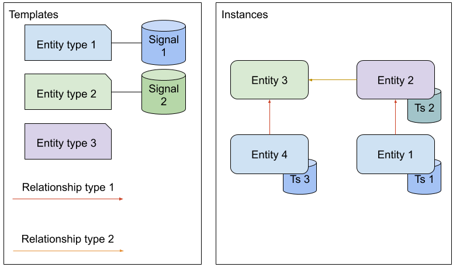

Data modelling
==============

The main data elements in the Exabel API are *entities* that represent some real world entities and *time series*
connected to those entities as *signals*. Entities may be interconnected in a *graph* with *relationships*.

Exabel maintains several sets of entities that can be used directly or connected to your own graph, for example:

* Companies
* Securities
* Regionals
* Listings
* Exchanges
* Countries

Custom entities must be of an *entity type* from Exabel's type catalogue. If you need new entity types to be added to
the catalogue, contact support@exabel.com.

Data separation
***************

All customers can connect their data to the entities maintained by Exabel in the global namespace.
However, data uploaded by a customer to their own namespace (for instance ``customer1``) remains
private to that customer. This includes entities, relationships, signals and time series.

Resource name structure and conventions
***************************************

Resource names in the Exabel Data API follow the `Google Cloud API recommendations`_. The ``name``
property of a resource is its resource name, which is a unique reference to the resource that
follows certain rules. (For display friendly names, use the ``displayName`` property.)

.. _Google Cloud API recommendations: https://cloud.google.com/apis/design/resource_names

A *resource name* consists of a collection ID and a resource ID joined by a forward slash (``/``).

The *collection ID* is the *type* of the resource, as defined by this API.

The *resource ID* consists of a namespace and an identifier. If the namespace is non-empty the parts
are joined by a period (``.``).

The *namespace* is either empty or the namespace given to the customer, for instance ``customer1``.

An *identifier* must start with a word character (``a-zA-Z0-9_``) and continue with any combination
of letters, numbers (``0-9``), hyphens (``-``) and underscores (``_``). Identifiers must be between
1 and 64 characters long (inclusive). Some resources have further restrictions on the allowed characters.

Some resource names start with another resource name as its *parent*.

Please note that resource names are case sensitive, so ``entities/customer1.APPLE`` is different from
``entities/customer1.apple``. By convention, entities have lower case names and relationships have
upper case names.

Examples of resource names
--------------------------
- entity type: ``entityTypes/company``, ``entityTypes/customer1.factory``
- relationship: ``relationshipTypes/LOCATED_IN``, ``relationshipTypes/customer1.OWNED_BY``
- entity (containing a parent): ,
  ``entityTypes/customer1.factory/entities/customer1.van_nelle``

Partial updates
***************

Some resources supports the ``PATCH`` method for partial update with i ``updateMask`` attribute,
which is a ``FieldMask``. For more information on how to use field masks, see the
`Google protobuf documentation`_. Note that if an ``updateMask`` is not specified, the update
behaves as a *full* update, overwriting all existing fields and properties.

.. _Google protobuf documentation: https://developers.google.com/protocol-buffers/docs/reference/google.protobuf#fieldmask
