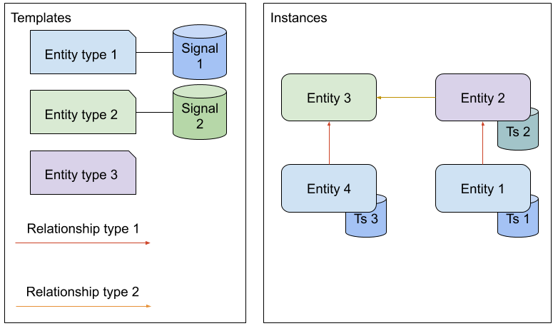

Introduction
==========================================

The Exabel Graph API is used to maintain and upload custom data to Exabel's Intelligent Modelling platform.

The main data elements are *entities* that represent some real world entities and *time series* connected to those
entities as *signals*. Entities may be interconnected in a *graph* with *relationships*.

Exabel maintains several sets of entities that can be used directly or connected to your own graph, for example:

* Companies
* Securities
* Listings
* Exchanges
* Countries

Custom entities must be of an *entity type* from Exabel's type catalogue. If you need new entity types to be added to
the catalogue, contact support@exabel.com.

Data separation
***************

All customers can connect their data to the entities maintained by Exabel. However, data uploaded
by a customer, remains private to that customer. This includes entities, relationships, signals, and time series.

Resource name conventions
*************************

Resource names in the Exabel Graph API follows Google Cloud API recommendation. The ``name`` property of a resource
is a unique reference to the resource, and follows certain rules. For user friendly names, use the ``display_name``
property. For more information, see https://cloud.google.com/apis/design/resource_names

Collection ids for all collections are defined by this API.

Resource ids must start with a letter, followup by letters, numbers, dot, hyphen (minus sign), or underscore.
Resource ids must be 1 to 64 characters long. Letters are limited to ASCII letters. Both uppercase and lowercase
letters are allowed.

Note that names are stored case sensitive, in other words, "APPLE" is not equal to "apple". By convention, entities
have lower case resource ids, and relationships have upper case ids.